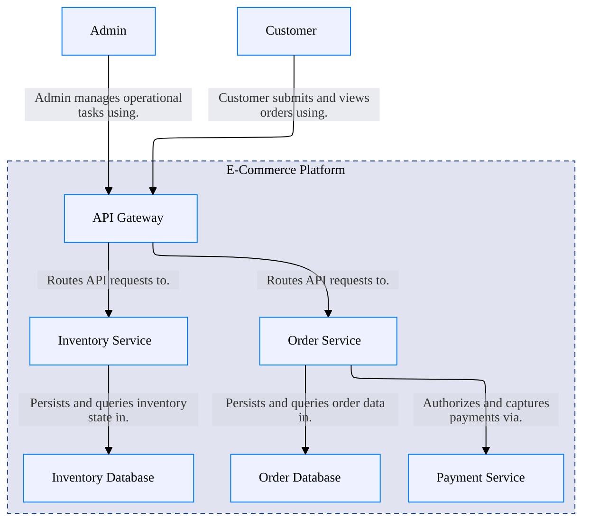

# Welcome to CALM Documentation

This documentation is generated from the **CALM Architecture-as-Code** model.

## High Level Architecture

## Nodes
- [Customer](nodes/customer)
- [Admin](nodes/admin)
- [E-Commerce Platform](nodes/ecommerce-platform-system)
- [API Gateway](nodes/api-gateway)
- [Order Service](nodes/order-service)
- [Inventory Service](nodes/inventory-service)
- [Payment Service](nodes/payment-service)
- [Order Database](nodes/order-database)
- [Inventory Database](nodes/inventory-database)

## Relationships
- [Ecommerce Platform Composed Of](relationships/ecommerce-platform-composed-of)
- [Customer Interacts With Api Gateway](relationships/customer-interacts-with-api-gateway)
- [Admin Interacts With Api Gateway](relationships/admin-interacts-with-api-gateway)
- [Api Gateway Connects Order Service](relationships/api-gateway-connects-order-service)
- [Api Gateway Connects Inventory Service](relationships/api-gateway-connects-inventory-service)
- [Order Service Connects Order Database](relationships/order-service-connects-order-database)
- [Order Service Connects Payment Service](relationships/order-service-connects-payment-service)
- [Inventory Service Connects Inventory Database](relationships/inventory-service-connects-inventory-database)

## Flows
- [Customer Order Processing](flows/order-processing-flow)
- [Inventory Stock Check](flows/inventory-check-flow)

## Metadata

    <table>
        <thead>
        <tr>
            <th>Key</th>
            <th>Value</th>
        </tr>
        </thead>
        <tbody>
        <tr>
            <th>Owner</th>
            <td>github-copilot@example.com</td>
        </tr>
        <tr>
            <th>Version</th>
            <td>1.0.0</td>
        </tr>
        <tr>
            <th>Created</th>
            <td>2026-03-15</td>
        </tr>
        <tr>
            <th>Description</th>
            <td>E-commerce order processing platform</td>
        </tr>
        <tr>
            <th>Tags</th>
            <td>ecommerce, microservices, orders</td>
        </tr>
        </tbody>
    </table>

## ADRs
- [docs/adr/0001-use-message-queue-for-async-processing.md](docs/adr/0001-use-message-queue-for-async-processing.md)
- [docs/adr/0002-use-oauth2-for-api-authentication.md](docs/adr/0002-use-oauth2-for-api-authentication.md)
