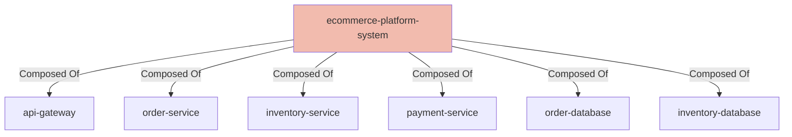

# E-Commerce Platform

## Details

    <table>
        <tbody>
        <tr>
            <th>Unique Id</th>
            <td>ecommerce-platform-system</td>
        </tr>
        <tr>
            <th>Name</th>
            <td>E-Commerce Platform</td>
        </tr>
        <tr>
            <th>Description</th>
            <td>System boundary containing the order processing microservices.</td>
        </tr>
        <tr>
            <th>Node Type</th>
            <td>system</td>
        </tr>
        </tbody>
    </table>

## Interfaces

No interfaces defined.

## Related Nodes

## Controls
_No controls defined._

## Metadata

    <table>
        <thead>
        <tr>
            <th>Key</th>
            <th>Value</th>
        </tr>
        </thead>
        <tbody>
        <tr>
            <th>Owner</th>
            <td>Platform Architecture</td>
        </tr>
        <tr>
            <th>Repository</th>
            <td>https://example.com/repo</td>
        </tr>
        <tr>
            <th>Deployment Type</th>
            <td>cloud</td>
        </tr>
        </tbody>
    </table>

