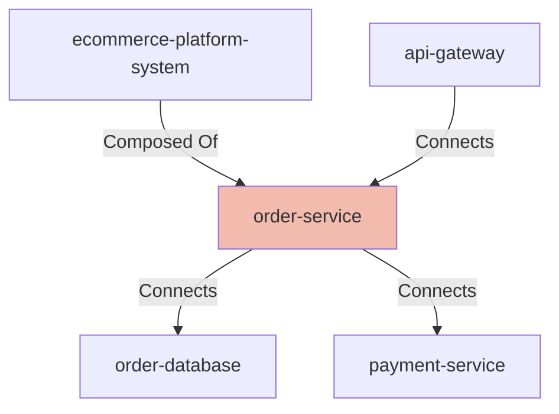

# Order Service

## Details

    <table>
        <tbody>
        <tr>
            <th>Unique Id</th>
            <td>order-service</td>
        </tr>
        <tr>
            <th>Name</th>
            <td>Order Service</td>
        </tr>
        <tr>
            <th>Description</th>
            <td>Creates and manages customer orders, orchestrating inventory reservation and payment authorization.</td>
        </tr>
        <tr>
            <th>Node Type</th>
            <td>service</td>
        </tr>
        </tbody>
    </table>

## Interfaces

    <table>
        <thead>
        <tr>
            <th>Unique Id</th>
            <th>Host</th>
            <th>Port</th>
        </tr>
        </thead>
        <tbody>
        <tr>
            <td>order-service-http</td>
            <td>order-service.internal</td>
            <td>8080</td>
        </tr>
        <tr>
            <td>order-service-db-client</td>
            <td></td>
            <td></td>
        </tr>
        </tbody>
    </table>

## Related Nodes

## Controls
_No controls defined._

## Metadata

    <table>
        <thead>
        <tr>
            <th>Key</th>
            <th>Value</th>
        </tr>
        </thead>
        <tbody>
        <tr>
            <th>Owner</th>
            <td>Orders Team</td>
        </tr>
        <tr>
            <th>Repository</th>
            <td>https://example.com/repo</td>
        </tr>
        <tr>
            <th>Deployment Type</th>
            <td>container</td>
        </tr>
        <tr>
            <th>Runtime</th>
            <td>java</td>
        </tr>
        <tr>
            <th>Sla Tier</th>
            <td>tier-1</td>
        </tr>
        </tbody>
    </table>

