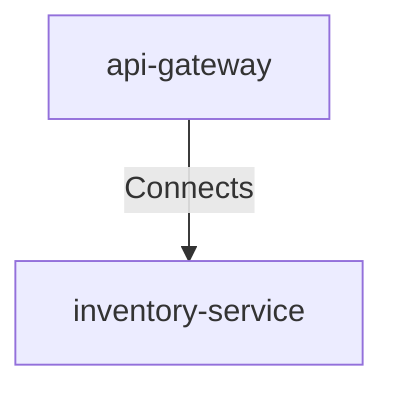

# Api Gateway Connects Inventory Service

## Details

    <table>
        <tbody>
        <tr>
            <th>Unique Id</th>
            <td>api-gateway-connects-inventory-service</td>
        </tr>
        <tr>
            <th>Description</th>
            <td>Routes API requests to.</td>
        </tr>
        <tr>
            <th>Protocol</th>
            <td>HTTPS</td>
        </tr>
        </tbody>
    </table>

## Related Nodes

## Controls
_No controls defined._

## Metadata

    <table>
        <thead>
        <tr>
            <th>Key</th>
            <th>Value</th>
        </tr>
        </thead>
        <tbody>
        <tr>
            <th>Monitoring</th>
            <td>true</td>
        </tr>
        <tr>
            <th>Latency Sla</th>
            <td>&lt; 200ms p95</td>
        </tr>
        <tr>
            <th>Availability</th>
            <td>99.9%</td>
        </tr>
        </tbody>
    </table>

