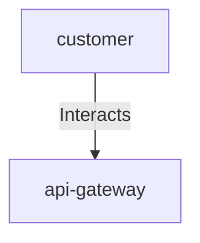

# Customer Interacts With Api Gateway

## Details

    <table>
        <tbody>
        <tr>
            <th>Unique Id</th>
            <td>customer-interacts-with-api-gateway</td>
        </tr>
        <tr>
            <th>Description</th>
            <td>Customer submits and views orders using.</td>
        </tr>
        </tbody>
    </table>

## Related Nodes

## Controls
_No controls defined._

## Metadata

No metadata defined.

