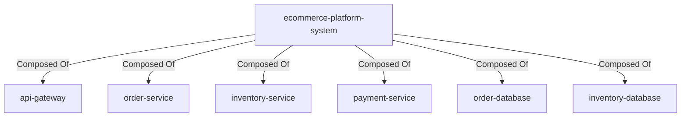

# Ecommerce Platform Composed Of

## Details

    <table>
        <tbody>
        <tr>
            <th>Unique Id</th>
            <td>ecommerce-platform-composed-of</td>
        </tr>
        <tr>
            <th>Description</th>
            <td>System boundary is composed of the platform services and data stores.</td>
        </tr>
        </tbody>
    </table>

## Related Nodes

## Controls
_No controls defined._

## Metadata

No metadata defined.

