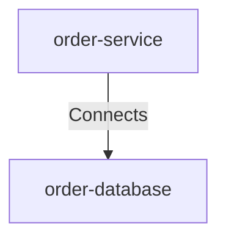

# Order Service Connects Order Database

## Details

    <table>
        <tbody>
        <tr>
            <th>Unique Id</th>
            <td>order-service-connects-order-database</td>
        </tr>
        <tr>
            <th>Description</th>
            <td>Persists and queries order data in.</td>
        </tr>
        <tr>
            <th>Protocol</th>
            <td>JDBC</td>
        </tr>
        </tbody>
    </table>

## Related Nodes

## Controls
_No controls defined._

## Metadata

    <table>
        <thead>
        <tr>
            <th>Key</th>
            <th>Value</th>
        </tr>
        </thead>
        <tbody>
        <tr>
            <th>Connection Pool</th>
            <td>default</td>
        </tr>
        <tr>
            <th>Encryption In Transit</th>
            <td>true</td>
        </tr>
        <tr>
            <th>Monitoring</th>
            <td>true</td>
        </tr>
        <tr>
            <th>Latency Sla</th>
            <td>&lt; 50ms p95</td>
        </tr>
        </tbody>
    </table>

