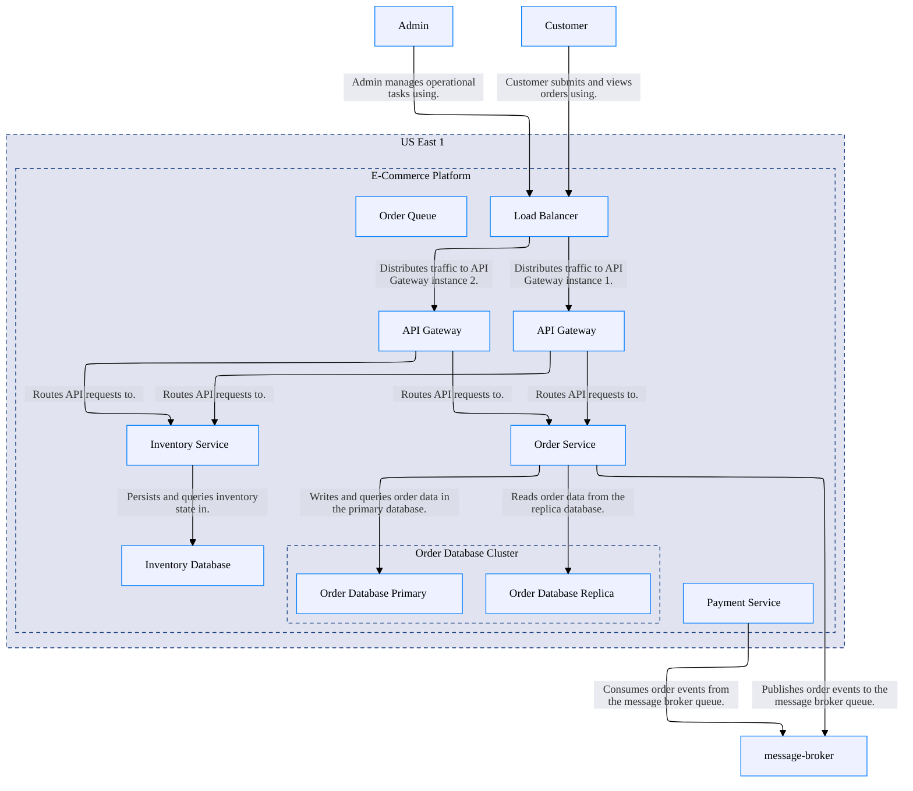

## Architecture Overview 

```mermaid
---
config:
  theme: base
  themeVariables:
    fontFamily: -apple-system, BlinkMacSystemFont, 'Segoe WPC', 'Segoe UI', system-ui, 'Ubuntu', sans-serif
    darkMode: false
    fontSize: 14px
    edgeLabelBackground: '#d5d7e1'
    lineColor: '#000000'
---
%%{init: {"layout": "elk", "flowchart": {"htmlLabels": false}}}%%
flowchart TB
classDef boundary fill:#e1e4f0,stroke:#204485,stroke-dasharray: 5 4,stroke-width:1px,color:#000000;
classDef node fill:#eef1ff,stroke:#007dff,stroke-width:1px,color:#000000;
classDef iface fill:#f0f0f0,stroke:#b6b6b6,stroke-width:1px,font-size:10px,color:#000000;
classDef highlight fill:#fdf7ec,stroke:#f0c060,stroke-width:1px,color:#000000;

        subgraph us-east-1["US East 1"]
        direction TB
                subgraph ecommerce-platform-system["E-Commerce Platform"]
                direction TB
                    api-gateway-1["API Gateway"]:::node
                    api-gateway-2["API Gateway"]:::node
                    inventory-database["Inventory Database"]:::node
                    inventory-service["Inventory Service"]:::node
                    load-balancer["Load Balancer"]:::node
                    order-queue["Order Queue"]:::node
                    order-service["Order Service"]:::node
                    payment-service["Payment Service"]:::node
                        subgraph order-database-cluster["Order Database Cluster"]
                        direction TB
                            order-database-primary["Order Database Primary"]:::node
                            order-database-replica["Order Database Replica"]:::node
                        end
                        class order-database-cluster boundary
                end
                class ecommerce-platform-system boundary
        end
        class us-east-1 boundary

    admin["Admin"]:::node
    customer["Customer"]:::node

    customer -->|Customer submits and views orders using.| load-balancer
    admin -->|Admin manages operational tasks using.| load-balancer
    load-balancer -->|Distributes traffic to API Gateway instance 1.| api-gateway-1
    load-balancer -->|Distributes traffic to API Gateway instance 2.| api-gateway-2
    api-gateway-1 -->|Routes API requests to.| order-service
    api-gateway-1 -->|Routes API requests to.| inventory-service
    api-gateway-2 -->|Routes API requests to.| order-service
    api-gateway-2 -->|Routes API requests to.| inventory-service
    order-service -->|Writes and queries order data in the primary database.| order-database-primary
    order-service -->|Reads order data from the replica database.| order-database-replica
    order-service -->|Publishes order events to the message broker queue.| message-broker
    payment-service -->|Consumes order events from the message broker queue.| message-broker
    inventory-service -->|Persists and queries inventory state in.| inventory-database


```