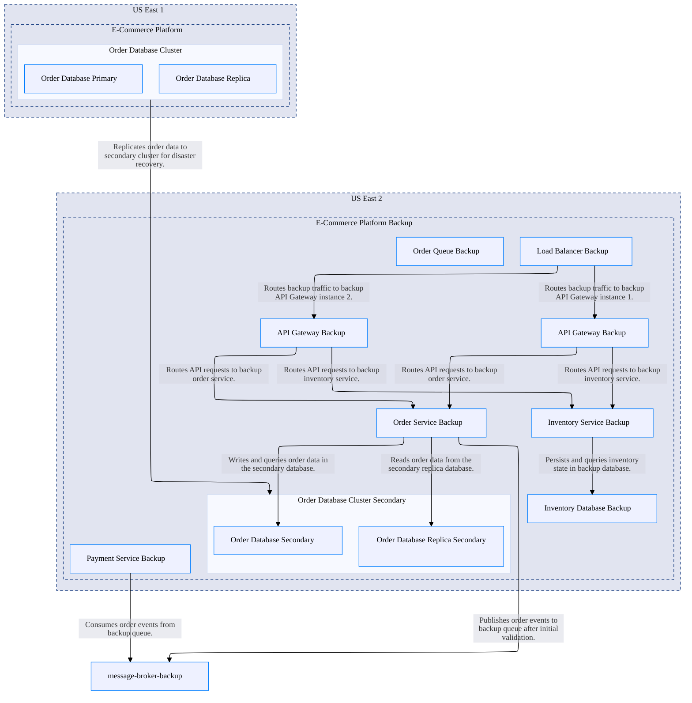

## Architecture Overview 

```mermaid
---
config:
  theme: base
  themeVariables:
    fontFamily: -apple-system, BlinkMacSystemFont, 'Segoe WPC', 'Segoe UI', system-ui, 'Ubuntu', sans-serif
    darkMode: false
    fontSize: 14px
    edgeLabelBackground: '#d5d7e1'
    lineColor: '#000000'
---
%%{init: {"layout": "elk", "flowchart": {"htmlLabels": false}}}%%
flowchart TB
classDef boundary fill:#e1e4f0,stroke:#204485,stroke-dasharray: 5 4,stroke-width:1px,color:#000000;
classDef node fill:#eef1ff,stroke:#007dff,stroke-width:1px,color:#000000;
classDef iface fill:#f0f0f0,stroke:#b6b6b6,stroke-width:1px,font-size:10px,color:#000000;
classDef highlight fill:#fdf7ec,stroke:#f0c060,stroke-width:1px,color:#000000;

        subgraph us-east-1["US East 1"]
        direction TB
                subgraph ecommerce-platform-system["E-Commerce Platform"]
                direction TB
                        subgraph order-database-cluster["Order Database Cluster"]
                        direction TB
                            order-database-primary["Order Database Primary"]:::node
                            order-database-replica["Order Database Replica"]:::node
                        end
                        class order-database-cluster boundary
                end
                class ecommerce-platform-system boundary
        end
        class us-east-1 boundary
        subgraph us-east-2["US East 2"]
        direction TB
                subgraph ecommerce-platform-system-backup["E-Commerce Platform Backup"]
                direction TB
                    api-gateway-1-backup["API Gateway Backup"]:::node
                    api-gateway-2-backup["API Gateway Backup"]:::node
                    inventory-database-backup["Inventory Database Backup"]:::node
                    inventory-service-backup["Inventory Service Backup"]:::node
                    load-balancer-backup["Load Balancer Backup"]:::node
                    order-queue-backup["Order Queue Backup"]:::node
                    order-service-backup["Order Service Backup"]:::node
                    payment-service-backup["Payment Service Backup"]:::node
                        subgraph order-database-cluster-secondary["Order Database Cluster Secondary"]
                        direction TB
                            order-database-replica-secondary["Order Database Replica Secondary"]:::node
                            order-database-secondary["Order Database Secondary"]:::node
                        end
                        class order-database-cluster-secondary boundary
                end
                class ecommerce-platform-system-backup boundary
        end
        class us-east-2 boundary


    load-balancer-backup -->|Routes backup traffic to backup API Gateway instance 1.| api-gateway-1-backup
    load-balancer-backup -->|Routes backup traffic to backup API Gateway instance 2.| api-gateway-2-backup
    api-gateway-1-backup -->|Routes API requests to backup order service.| order-service-backup
    api-gateway-1-backup -->|Routes API requests to backup inventory service.| inventory-service-backup
    api-gateway-2-backup -->|Routes API requests to backup order service.| order-service-backup
    api-gateway-2-backup -->|Routes API requests to backup inventory service.| inventory-service-backup
    order-service-backup -->|Publishes order events to backup queue after initial validation.| message-broker-backup
    payment-service-backup -->|Consumes order events from backup queue.| message-broker-backup
    inventory-service-backup -->|Persists and queries inventory state in backup database.| inventory-database-backup
    order-service-backup -->|Writes and queries order data in the secondary database.| order-database-secondary
    order-service-backup -->|Reads order data from the secondary replica database.| order-database-replica-secondary
    order-database-cluster -->|Replicates order data to secondary cluster for disaster recovery.| order-database-cluster-secondary


```